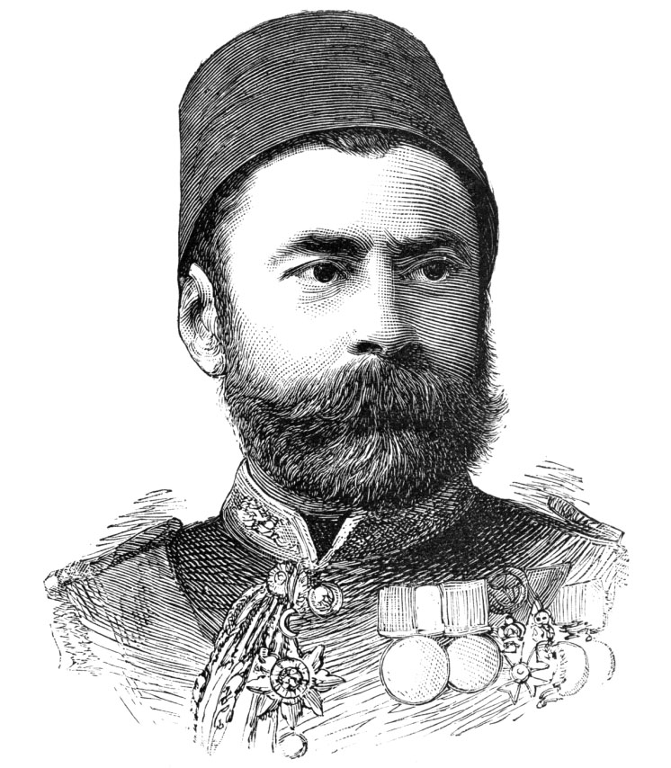
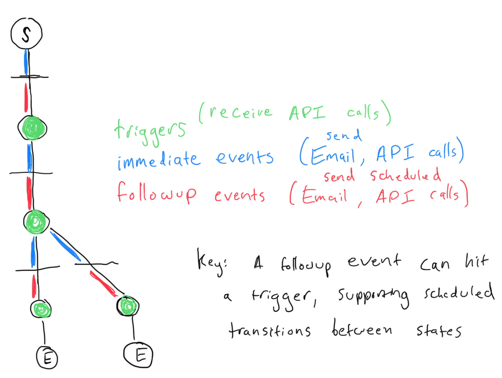

# Overview
Longitudinal behavioral research relies increasingly on the integration of multiple web apps. Vizier is intended to provide a "glue layer" that maintains a stateful representation of study participants, and coordinates calls to these web apps  

The motivation for factoring out particpant management is two-fold. First, it decreases implementation cost of building out participant management in each of the component web apps. Second, it allows for the scheduling system to focuses on the conditional logic needed for transitioning participants between states in the experiment, isolating that from the sampling logic of the component instruments / web apps. 

Vizier is designed to provide a maximally general set of functions to coordinate a wide range of web apps and services. At its core, it provides for

- Declarative specification of studies as tree structures, where nodes are called *triggers* and edges are called *states*
- Stateful participant tracking (= position in the tree structure)
- API endpoints to receive external triggers (from an external web app to Vizier)
- Scheduled API calls (technically a call scheduled to be made from Vizier to a Vizier endpoint) 
- Chaining  API calls when triggers are hit (from external web app to Vizier to external web app)
- email functionality, such that Vizier can send off emails (equivalent to hitting an external API)  

The above functions are implemented with a very small, maximally general set of endpoints in a Flask web app, plus a scheduling system. 

In the signal development case, Vizier coordinates between REDCap (a participant management system), Wordful (a smarthpone app with an accounts system), and WebCDI (a web app with an accounts system) in a second pilot study for Wordful. In concert, these three components collect participant consent, allow parents to report vocab for weeks or months through the smartphone, and administers two WebCDI administrations (desktop or laptop-based vocab evaluations). Rather than build out features in Wordful to interact with REDCap and WebCDI, Vizier instead provides a set of general-purpose communication and participant state-tracking functions that allow it to communicate with all three of these web apps. Each study is represented as a set of segments. Each segment has exactly one upstream segment and one or more downstream segments. Every segment has a unique name; cycles are not allowed. A study is composed of a single start segment (initialization), one or more event segments, and one or more end segments. This supports branching logic, which the Wordful scheduler does not handle. Because of the dependence of triggers, a participant may move around on the state tree (though by default checking is used to only permit them to advance state to the next connected segment)

Each event segment conists of immediate events and followup events. Immediate events happen when a user starts that segment. Followup events only occur if a user has not completed that segment, i.e., if they complete a segment then any associated followup events are removed from the scheduler. Events, whether immediate or followup, belong to one of two types: 

- "api" is an API call that Vizier makes to another web app
- "email" is an email generated by Vizier (and delivered by a 3rd party API)

Both kinds of events have access to the stateful representation of the user (data previously sent to Vizier), and can include this information in either the email content or in API calls. 

Waiting for a duration before transitioning state is a special case of a followup "API" event. This involves making a scheduled call to the `update/` route on Vizier itself. Like Wordful, Vizier uses the APScheduler package backed by a Postgres instance to keep track of queued events. Queued events are executed by sending off an API call to the 

# Specifics of the Wordful study

The user flow in the Wordful pilot (for a parent/caregiver) is:

1. User clicks Facebook ad
2. User visits REDCap, completes consenting process
3. REDCap uses the "data entry trigger" functionality to instantiate a new record in Vizier by hitting the `addUser` route on Vizier, and includes the `studyId` as a URL parameter. Vizier now knows the position of the user in the tree representation of the study (initialized) 
4. Following the directions in the study specification, Vizier sends the user a user-specific WebCDI link as an email. Vizier now sees this user as being in the "WebCDI1" state.
5. When the user completes the first WebCDI, the WebCDI app hits the `registerSegmentCompletion` endpoint of Vizier to register that the participant should transition to the next segment of the study. If the user does not do this after 2 days, Vizier sends a follow-up email; it will do the same after 4 days. In both cases, specific information about the user (provided in the initialization) is used to populate the email.
6. Following the directions in the study specification, Vizier sends off an immediate API call to Wordful, instantiating a user in Wordful, passing the study as a parameter. 
7. At the end of onboarding in Wordful, Wordful hits the `registerSegmentCompletion` endpoint of Vizier to register that the participant has completed onboarding and should transition to the next segment of the study... 
6. In the case of the 2nd Wordful pilot, this requires a scheduled self-call to the API to transition the user to the next part of the study after a defined interval (i.e. 30 days), rather than waiting for one of the external web apps to hit Vizier
7. After e.g. 30 days, Vizier self-calls registerSegmentCompletion and transitions the user to the next state...
8. ... first sending them an email with a link to the second CDI (same as step 4) 
9. Same as step 5
10. When WebCDI registers the 2nd completion of the CDI, Vizier sends an API call to the compensation web app (Vizier could also include a compensation stack, TBD)

# Example Study Specification

A Vizier study specification --- a tree of segments that allows for the steps above--- for the ContinuousCDI study is shown in `example_study_specification.json`

# API endpoints

**`/addUser(vizierStudyId, payload)`**: instantiates a user in Vizier with an arbitrary JSON payload

***args:***
`vizierStudyId`: name of the JSON tree specification for the study  
`payload`: a JSON with user properties that will be persistently available in Vizier (unless updated). If the payload includes an `identifier` field, then Vizer will check if any previous users in this study have the same identifier, and return an error if so. Consent capture apps (REDCap, Qualtrics) should set this field to the participant's email to avoid multiply instantiating a user. 

***returns:***
`{"vizierUserId": <uniqueId,int>}` The consent capture app should check that the user was properly initialized in Vizier

***errors:***
`studyIdNotSpecified`: Vizier must know the studyId associated with the new user  
`userAlreadyExists`: user with same `identifier` already exists in the study

---

**`/registerSegmentCompletion(vizierUserId, vizierSegmentId, payload)`**: updates the state of a user in Vizier. This includes

- evaluating whether this is a well-formed update call
- registering completion for the previous segmentId
- cancel outstanding events for the previous segmentId
- processing all immediate events for the new segment(s) (as identified by segmentId)
- scheduling the followup events for the next segment(s)
- updating the state of the user to reflect the new segment 

***args:***
`vizierUserId`: userId in Vizier  
`vizierSegmentId`: name of the just-completed segment  
`payload`: a JSON with any information to associate with this segment  

***returns:***
`{"success": 1}`

***errors:***
`userNotExist`: user must exist  
`segmentNotExist`: the study for this user must have this segment  

---

**`removeUser(vizierUserId)`**: remove a user from state tracking in Vizier

***args:***
`vizierUserId`: userId in Vizier 

***returns:***
`{"success": 1}`

***errors:***
`userNotExist`: user must exist

---

**`inviteUser(vizierStudyId, payload)`**

***args:***
`vizierStudyId`: name of the JSON tree specification for the study  
`identifier`: JSON with any information needed to make the invitation

***returns:***
`{"success": 1}`

***errors:***
`studyIdNotSpecified`: Vizier must know the studyId  
`identifierNotSpecified`: Vizier must have information (e.g. email or phone number) to make an invite  

---

**`/scheduledEventHandler(args)`** : run a scheduled event (effectively, a scheduled call to another Vizier endpoint)

***args:***
`vizierUserId`: userId in Vizier  
`vizierStudyId`: name of the JSON tree specification for the study  
`vizierEventId`: name of the event  

***returns:***
`{"success": 1}`

***errors:***
`urlNotDefined`: If an API call, a URL must be defined  
`methodNotRecognized`: must be one of "email" or "api"  

# Scheduling Format

If an event is in followup_events, then it needs to have a schedule field. A schedule node has a schedule string in the format `<schedule_type>_<days>`. "e_30" means trigger this event 30 days from now (at this time; Vizier does not track user timezone, so it cannot send messages at a specific time. This could be added easily by adding a user representation that keeps that information, but this would also require connected web apps to make requests to update the timezone of the user, in that the user does not themselves use a frontend that can update Vizier with this information.

# Security

Assuming that only other web backends will call Vizier, there is no need for obfuscation in the API. 

An adversarial user could try to figure out how to make an API call that ends a study prematurely 

#  Example API calls

1. On completion, WebCDI1 would hit an endpoint on Vizier, <vizierURL>/update with a JSON like:

{
    "userId": <userId>
    "segment": <hashed_segment_id>"
    "state": <state>,
    "user_vars": {
        "subject_id":<webcdi.subject_id>
    }
}

This call would:
    - update the user_vars for this user with anything in the user_vars field (see JSON above)
    - remove anything in the schedulder from the segment WebCDI1
    - update the user state, transitioning them to the final state in 'next_segment_names'
    - process any immediage_events in the next segments
    - Update the scheduler with any events from the next segments

Connected systems must have a way to confirm that Vizier state was updated. Note that this is a requirement of any robust system.

# Desiderata 

- [x] A way to transitions states as a function of time
- [x] A way to represent user state, in a researcher-readable way: Keep track of last_completed sequence
- [x] A way to receive API calls from other web apps
- [X] A way to make API calls (scheduled, or after the reception of an API call through updateSegment)
- [x] A way to mintain state for  values for each user: Firebase
- [ ] Email follow-ups
- [ ] A way to serve dynamic webpages (landing / instruction) -- can pass and do immediate emails; skip the Javascript nonsense
